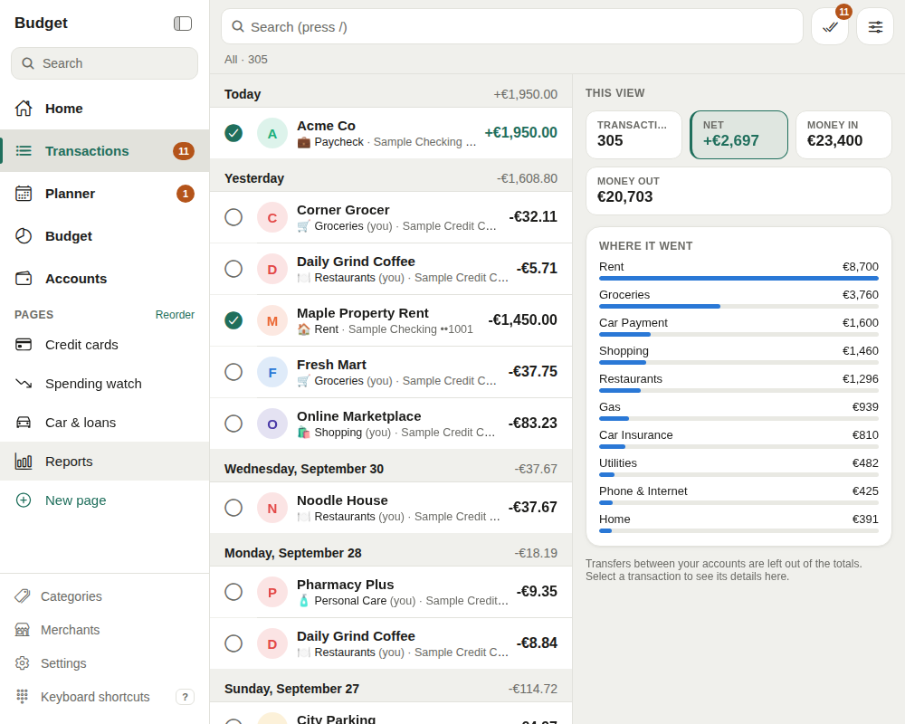
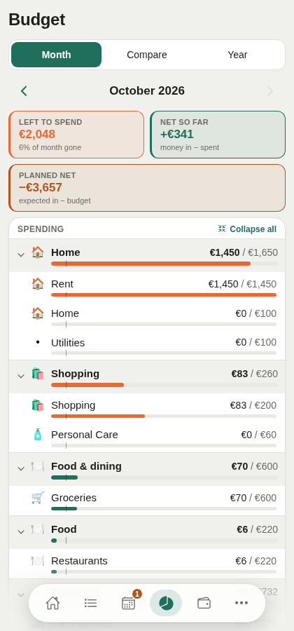
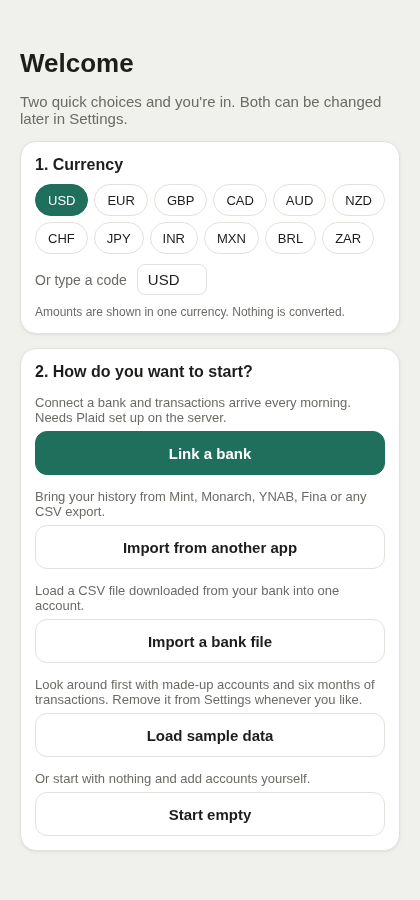

# budget-app

A budgeting app you host yourself. Your bank connects through your own Plaid account, new transactions land in a review inbox, rules learn your categories and merchant names, and a weekly planner shows whether the bills fit. Nothing is shared with a third-party budgeting service.

It runs on the web, iPhone and Android from one codebase, and fits in the free tiers of Supabase, Plaid and Vercel.

> **Each person runs their own copy.** Fork the repo, create your own Supabase project, and follow **[docs/SELF_HOSTING.md](docs/SELF_HOSTING.md)**. Plaid is optional: you can import files or add accounts by hand.

| Transactions | Budget | First run |
| --- | --- | --- |
|  |  |  |

Screenshots show the built-in sample data.

## What it does

- **Bank sync (optional).** Link banks through Plaid, with a daily sync at 5 AM in your time zone, **Sync now**, and **Fix** for connections that need a new sign-in.
- **Transactions.** Grouped by day, with search, filters, sorting and a review inbox for new arrivals. Edit dates and amounts, add notes and tags, split across categories.
- **Auto-categorisation.** Your rules first, then what you chose last time for that merchant, then the bank's category. Changing a category can become a rule.
- **Merchant cleanup.** Rules turn `POS PURCHASE 0010 CRNR MKT 1077` into `Corner Market`. Logos and your own pictures for merchants and accounts.
- **Budgets.** Monthly budgets per category or group, rollover, comparisons and a year view.
- **Bills, income and a weekly planner.** Schedules matched to payments automatically, a running balance per account, and a warning before an account dips below its buffer.
- **Accounts.** Cash, credit cards and loans: utilisation, statement and due dates, payoff estimates, interest.
- **Reports and widgets.** Spending by category and merchant, cash flow, net worth. Every page is a board of widgets you can rearrange, resize and add to, and you can make pages of your own.
- **Import.** From another budgeting app (Mint, Monarch, YNAB and Fina exports are recognised; any other CSV lets you pick the columns), or a CSV file from your bank. Both skip what is already there.
- **First-run setup.** Pick a currency, then link a bank, import, load sample data or start empty.
- **Works like an app.** Installable from the browser, keyboard shortcuts on desktop, light and dark themes.

## How it fits together

```
apps/app/                 Expo app (iOS, Android, web) ── talks to ──┐
packages/core/            Shared logic + tests (merchants, rules,    │
                          imports, budgets, planner, dates)          │
supabase/                                                            ▼
├── migrations/           Postgres tables + row-level security   Supabase
├── functions/            Edge Functions (Deno):                 (your project)
│   ├── plaid-link-token  start Plaid Link                           │
│   ├── plaid-exchange    save a new bank connection                 │
│   ├── plaid-sync        daily / on-demand sync  ◀── pg_cron        │
│   ├── plaid-remove      disconnect a bank                          ▼
│   └── _shared/          Plaid client, sync logic, copy of core    Plaid
└── setup/cron.sql        schedules the daily sync
```

Amounts follow one rule everywhere: **money out is negative, money in is positive.** Dates are plain `YYYY-MM-DD` calendar days, so no time zone can shift them. Amounts are shown in one currency (chosen at setup); nothing is converted.

## Development

```bash
npm install
npm test                 # core logic tests (Vitest)
npm run test:functions   # Edge Function sync tests (needs Deno)
npm run typecheck        # core + app
npm run web              # run the app in a browser (needs apps/app/.env)
npm run sync-core        # after changing packages/core: copy it into the Edge Functions
```

### Database changes

`supabase/migrations/` starts with one file that creates the whole 2.0 schema. Add later changes as new, dated files after it. Never edit a migration that has already been pushed to a database.

## Security

See **[SECURITY.md](SECURITY.md)** for where each secret lives and how data is protected. In short: never commit `.env` files, keep Plaid keys and the cron secret in Supabase secrets, and turn off new sign-ups once your account exists.

## Licence

[MIT](LICENSE)
